# MacroTool マクロ動作機能仕様書
- Version: Macro_v1.0.0  
- 作成日: 2026-02-12  
- 開発環境: Visual Studio 2026  
- 開発言語: C#  
- 設計思想: ドメイン駆動設計（DDD） + テスト駆動開発（TDD）  
> 本書「3. 機能一覧」は、添付 Excel（Macro仕様書_v3.xlsx）の **v1.0 シート**を反映している。  
> 「状態」列は指定により **全て空欄**。  

---

## 1. 目的・概要

本仕様書は、MacroTool における **マクロの作成・編集・実行**、および関連する **マウス／キーボード操作、待機、検出、制御構文** 機能の仕様を定義する。

---

## 2. 用語

- **マクロ**: 操作手順（アクション）を並べた実行単位  
- **アクション**: マクロを構成する 1 ステップ（例: Click / Wait / Find image 等）  
- **Variable**: 実行中に値（文字列・数値・座標など）を保持する領域  
- **(ユーザー定義Label一覧…)**: ジャンプ先として参照可能な行識別子  
- **GoTo**: 指定行（Start/End/Next/(ユーザー定義Label一覧…)）へ実行位置を移動する制御  

---

## 3. 機能一覧

- 列「UI画像」：`docs/images` 配下の参照画像（複数ある場合は ` ` 区切り）  
- 列「状態」：指定により空欄  

---

### 3.1 File（ファイル操作）

| 開発ID | 機能名 | 概要 | 起動/操作 | 備考 | UI画像 | 状態 |
|---|---|---|---|---|---|---|
| 1 | File | Fileに関する操作欄 | Fileに関する操作画面タブ |  | [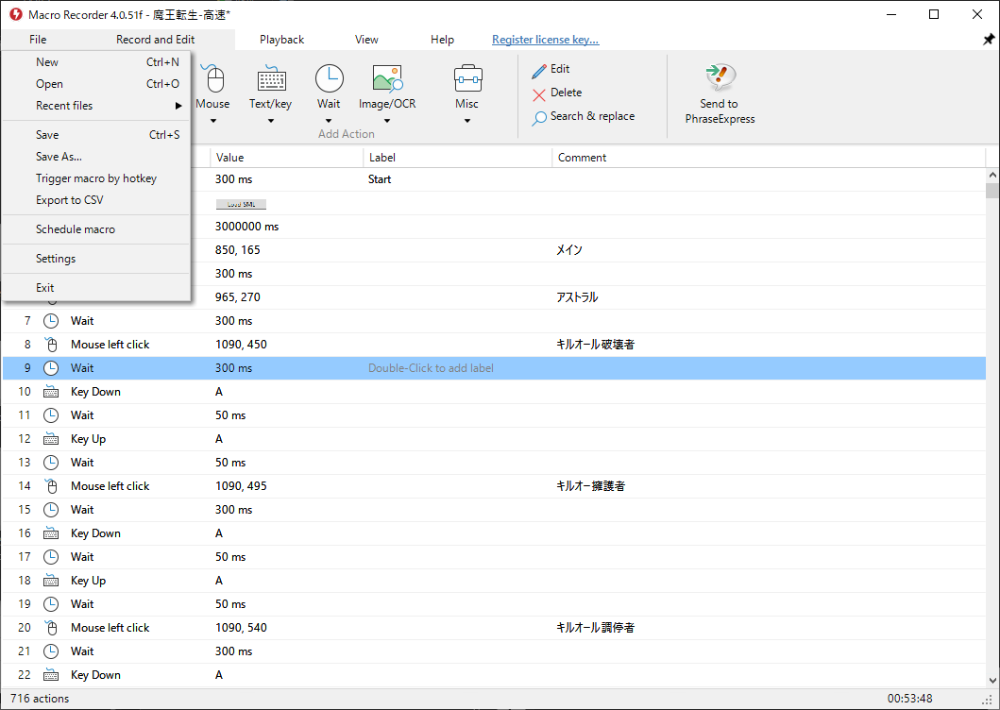](../images/1_File.png) |  |
| 1-1 | New | 新規マクロの作成 | 新規にマクロを作成 |  |  |  |
| 1-1-1 | Confirmation | 未保存マクロ確認画面 | 未保存のマクロがあるときにクリックすると出現 |  |  |  |
| 1-1-1-1 | Yes | はい | マクロの保存を行い、新規マクロを作成する |  |  |  |
| 1-1-1-2 | No | いいえ | マクロを保存せず、新規に作成する |  |  |  |
| 1-1-1-3 | Cancel | キャンセル | キャンセル |  |  |  |
| 1-2 | Open | 既存マクロを開く | 既存のマクロファイルを開く |  |  |  |
| 1-2-1 | Confirmation | 未保存マクロ確認画面 | 未保存のマクロがあるときにクリックすると出現 |  |  |  |
| 1-2-1-1 | Yes | はい | マクロの保存を行い、既存マクロを開く |  |  |  |
| 1-2-1-2 | No | いいえ | マクロを保存せず、既存マクロを開く |  |  |  |
| 1-2-1-3 | Cancel | キャンセル | キャンセル |  |  |  |
| 1-3 | Recent Files | 最近開いたマクロを表示 | カーソルを合わせると、最近開いたマクロが表示される。件数は10件まで。 |  |  |  |
| 1-4 | Save | マクロを保存 | マクロを保存、新規の場合は名前を付けて保存 |  |  |  |
| 1-4-1 | Confirmation | 未保存マクロ確認画面 | 未保存のマクロがあるときにクリックすると出現 |  |  |  |
| 1-4-1-1 | Yes | はい | マクロの保存を行い、既存マクロを開く |  |  |  |
| 1-4-1-2 | No | いいえ | マクロを保存せず、既存マクロを開く |  |  |  |
| 1-4-1-3 | Cancel | キャンセル | キャンセル |  |  |  |
| 1-5 | Save As… | マクロを名前を付けて保存 | 名前を付けて保存 |  |  |  |
| 1-6 | Export CSV | CSVとして出力 | マクロ動作内容CSVとして出力する |  |  |  |
| 1-7 | Import CSV | CSVから取り込み | CSVの内容を読み取り、マクロ動作内容を選択行された行から追加する |  |  |  |
| 1-8 | Schedule macro | マクロの起動をスケジュールする | 常駐、起動していない場合は実行しない。 |  | [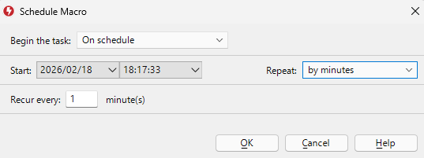](../images/1-8_ScheduleMacro.png) |  |
| 1-8-1 | yyyy/MM/dd | 開始年月日 | 開始年月日 |  |  |  |
| 1-8-2 | HH:mm:ss | 開始時刻 | 開始時刻 |  |  |  |
| 1-8-3 | Repeat | Repeat条件 | Repeat条件 |  |  |  |
| 1-8-3-1 | Execute one | 1回だけ実行 | 1回だけ実行 |  |  |  |
| 1-8-3-2 | by minutes | 分実行 | 指定された分の間隔で実行 |  |  |  |
| 1-8-3-3 | by hours | 時実行 | 指定された時間の間隔で実行 |  |  |  |
| 1-8-3-4 | by days | 日実行 | 指定された日にちの間隔で実行 |  |  |  |
| 1-8-3-5 | by weeks | 週実行 | 指定された週の間隔で実行 |  |  |  |
| 1-8-3-6 | by months | 月実行 | 指定された月の間隔で実行 |  |  |  |
| 1-8-4 | OK | OKボタン | Scheduleを決定 |  |  |  |
| 1-8-5 | Cancel | Cancelボタン | Cancel |  |  |  |
| 1-9 | Settings | 設定画面を開く |  |  | [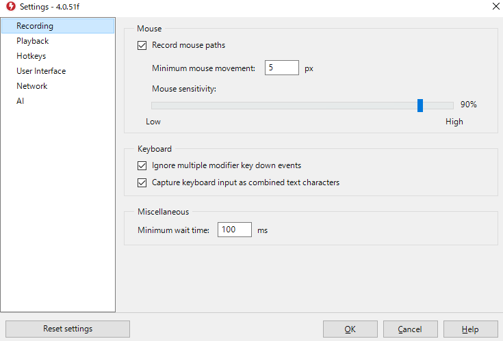](../images/1-9-1_Recording.png)  [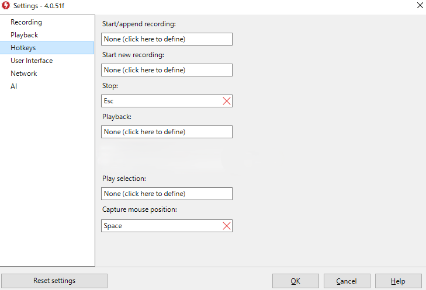](../images/1-9-3_Hotkeys.png) [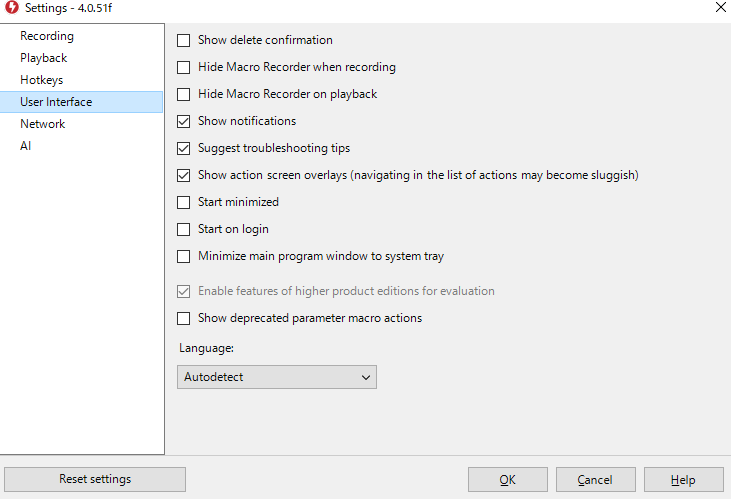](../images/1-9-4_UserInterface.png) |  |
| 1-9-1 | Recording | 記録に関する設定画面 |  |  |  |  |
| 1-9-1-1 | Record mouse paths | マウスの軌道を記録 |  |  |  |  |
| 1-9-1-2 | Minimum mouse movement | マウスの軌道を記録する間隔 |  |  |  |  |
| 1-9-1-4 | Ignore multiple modifier key down events | 複数のキーダウンイベントを無効する |  |  |  |  |
| 1-9-1-6 | minimum wait time | 最小待機時間 | 最小待機時間を超えたものは別イベントとして扱う |  |  |  |
| 1-9-2 | Playback | 再生に関する設定画面 |  |  |  |  |
| 1-9-2-1 | Block key presses during playback | 再生中のキー入力を無効 |  |  |  |  |
| 1-9-2-2 | Abort playback on key press | キー入力で再生を止める |  |  |  |  |
| 1-9-2-3 | Abort playback on mouse move | マウス移動でキー入力を止める |  |  |  |  |
| 1-9-2-4 | Restore mouse position after playback | 再生後マウス位置を再生開始時の位置に戻す |  |  |  |  |
| 1-9-2-5 | Restore window sizes | ウィンドウサイズを戻す |  |  |  |  |
| 1-9-2-6 | Use relative mouse positions | マウスの相対位置を記録する。 |  |  |  |  |
| 1-9-2-7 | Reset variables and list counter on each playback cycle | Cycle毎のvariables, counterの値リセット | Cycle毎にvariables, counterの値をリセットする |  |  |  |
| 1-9-3 | Hotkeys | ショートカットキー |  |  |  |  |
| 1-9-3-1 | Start/append recording | 開始 |  |  |  |  |
| 1-9-3-2 | Start new recording | 新規にマクロを作成し録画 |  |  |  |  |
| 1-9-3-3 | Stop | 停止 |  |  |  |  |
| 1-9-3-4 | Playback | 再生 |  |  |  |  |
| 1-9-3-5 | Play selection | 選択中のマクロ動作を再生 |  |  |  |  |
| 1-9-3-6 | Capture mouse position | マウス位置をキャプチャ | マクロ動作編集中、マウス位置をキャプチャし、マクロ動作に反映 |  |  |  |
| 1-9-4 | User interface | ユーザーインターフェース関連せって |  |  |  |  |
| 1-9-4-1 | Show delete confirmation | 削除時に確認 |  |  |  |  |
| 1-9-4-2 | Hide Macro Recorder when recording | 記録中マクロ記録ツールを隠す |  |  |  |  |
| 1-9-4-3 | Hide Macro Recorder on playback | 再生中マクロ記録ツールを隠す |  |  |  |  |
| 1-9-7 | Reset settings | デフォルト設定 |  |  |  |  |
| 1-9-8 | OK | OKボタン | 設定の保存 |  |  |  |
| 1-9-9 | Cancel | Cancelボタン | 設定のキャンセル |  |  |  |
| 1-10 | Exit | ツールを終了する |  |  |  |  |
---

### 3.2 Record and Edit（記録・編集）

| 開発ID | 機能名 | 概要 | 起動/操作 | 備考 | UI画像 | 状態 |
|---|---|---|---|---|---|---|
| 2 | Record and Edit | マクロの記録、編集に関する操作欄 |  |  | [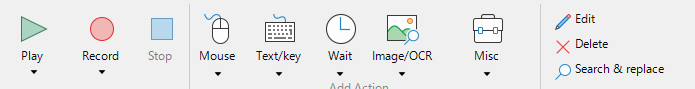](../images/2_RecordAndEdit.png) |  |
| 2-1 | Play | マクロを再生 |  |  |  |  |
| 2-1-1 | Play until selected | 選択行までマクロを再生 |  |  |  |  |
| 2-1-2 | Play from selected | 選択行からマクロを再生 |  |  |  |  |
| 2-1-3 | Play selected | 選択行を再生 |  |  |  |  |
| 2-2 | Record | マクロを記録する |  |  |  |  |
| 2-2-1 | Insert Record | 選択行からマクロを記録する |  |  |  |  |
| 2-3 | Stop | マクロの再生を停止 |  |  |  |  |
---

### 3.3 Mouse（マウス操作）

| 開発ID | 機能名 | 概要 | 起動/操作 | 備考 | UI画像 | 状態 |
|---|---|---|---|---|---|---|
| 2-4 | Mouse | マウスに関わる操作 |  |  |  |  |
| 2-4-1 | Click | クリック動作画面 | マウスのクリックに関わる画面 |  |  |  |
| 2-4-1-1 | Mouse button | マウスのボタン | 右、左、真ん中、サイドボタン1、サイドボタン2 |  |  |  |
| 2-4-1-2 | Action | 動作 | クリック、ダブルクリック、押す、離す |  |  |  |
| 2-4-1-3 | Relative | 相対座標OnOffスイッチ | Onなら現在のマウス座標からの移動、Offなら絶対座標 |  |  |  |
| 2-4-1-4 | X | X座標 | マウス位置のX座標 |  |  |  |
| 2-4-1-5 | Y | Y座標 | マウス位置のY座標 |  |  |  |
| 2-4-1-6 | OK | OKボタン | 動作の追加 |  |  |  |
| 2-4-1-7 | Cancel | Cancelボタン | Cancel |  |  |  |
| 2-4-2 | Move | 移動動作画面 | マウスの移動に関わる画面 |  | [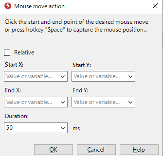](../images/2-4-2_Move.png) |  |
| 2-4-2-1 | Relative | 相対座標OnOffスイッチ | Onなら現在のマウス座標からの移動、Offなら絶対座標 |  |  |  |
| 2-4-2-2 | Start X | 開始X座標 | マウス位置の開始X座標 |  |  |  |
| 2-4-2-3 | Start Y | 開始Y座標 | マウス位置の開始Y座標 |  |  |  |
| 2-4-2-4 | End X | 終了X座標 | マウス位置の終了X座標 |  |  |  |
| 2-4-2-5 | End Y | 終了Y座標 | マウス位置の終了Y座標 |  |  |  |
| 2-4-2-6 | Duration | 間隔時間 | マウス位置の開始から終了までにかかる時間の指定 |  |  |  |
| 2-4-2-7 | OK | OKボタン | 動作の追加 |  |  |  |
| 2-4-2-8 | Cancel | Cancelボタン | Cancel |  |  |  |
| 2-4-3 | Wheel | ホイール動作画面 | マウスのホイールに関わる画面 |  |  |  |
| 2-4-3-1 | Wheel orientation | 水平、垂直 | 水平、垂直 |  |  |  |
| 2-4-3-2 | Value | 値 | ホイール時の値 |  |  |  |
| 2-4-3-3 | OK | OKボタン | 動作の追加 |  |  |  |
| 2-4-3-4 | Cancel | Cancelボタン | Cancel |  |  |  |
---

### 3.4 Text/Key（テキスト・キーボード）

| 開発ID | 機能名 | 概要 | 起動/操作 | 備考 | UI画像 | 状態 |
|---|---|---|---|---|---|---|
| 2-5 | Text/Key | テキスト、キーボードに関わる動作 |  |  | [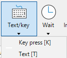](../images/2-5_TextKey.png) |  |
| 2-5-1 | Key press | キーボードに関わる動作画面 |  |  |  |  |
| 2-5-1-1 | Key press option | キーボードの動作 | Press、Down、Up |  |  |  |
| 2-5-1-2 | Key | キー | キーボードのキー全て |  |  |  |
| 2-5-1-3 | Count | 回数 | 回数 |  |  |  |
| 2-5-1-4 | OK | OKボタン | 動作の追加 |  |  |  |
| 2-5-1-5 | Cancel | Cancelボタン | Cancel |  |  |  |
| 2-5-2 | Hotkey | ホットキー | ホットキーの設定 |  | [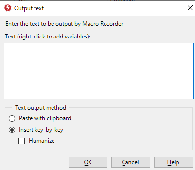](../images/2-5-2_Text.png) |  |
| 2-5-2-1 | Press hotkey now | ホットキーの表示 | 入力されているホットキーを表示 | 例：Ctrl+Z |  |  |
| 2-5-2-2 | OK | OKボタン | 動作の追加、入力されたホットキーに相当する複数のKey press項目を追加 | Ctrl+Zの場合、「Ctrl Down」, 「Z press」, 「Ctrl Up」の3つのKey press動作を追加する |  |  |
| 2-5-2-3 | Cancel | Cancelボタン | Cancel |  |  |  |
---

### 3.5 Wait（待機）

| 開発ID | 機能名 | 概要 | 起動/操作 | 備考 | UI画像 | 状態 |
|---|---|---|---|---|---|---|
| 2-6 | Wait | 待機に関わる動作 |  |  | [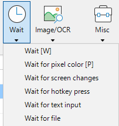](../images/2-6_Wait.png) |  |
| 2-6-1 | Wait | 時間待機に関わる動作画面 |  |  | [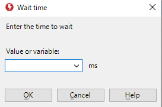](../images/2-6-1_Wait.png) |  |
| 2-6-1-1 | Value | 待機時間(ms) |  |  |  |  |
| 2-6-1-2 | OK | OKボタン | 動作の追加 |  |  |  |
| 2-6-1-3 | Cancel | Cancelボタン | Cancel |  |  |  |
| 2-6-2 | Wait for pixel color | 色待機に関わる動作画面 | 成功時の動作はIf true Go to、失敗時の動作はIf false Go to |  |  |  |
| 2-6-2-1 | X | X座標 | 色を監視するX座標 |  |  |  |
| 2-6-2-2 | Y | Y座標 | 色を監視するY座標 |  |  |  |
| 2-6-2-3 | Color | カラーコード | #FFFFFF |  |  |  |
| 2-6-2-4 | Color表示 | カラーコードの色 | カラーコードの色を可視化 |  |  |  |
| 2-6-2-5 | Color tolerance | 色許容度 | 0-100% | RGB距離、監視頻度は20ms(設定画面で設定可能) |  |  |
| 2-6-2-6 | If true Go to | 検出成功時の動作 | Start, End, Next, Label | Labelはユーザーが定義したラベルの値すべてを表示、Startはマクロ先頭行、Endはマクロ最終行、Nextはマクロの次の行、Labelは一致するLabelの行 |  |  |
| 2-6-2-7 | Waiting ms | 検出までの待機時間(ms) | 単位はms |  |  |  |
| 2-6-2-8 | If false Go to | 検出失敗時の動作 | Start, End, Next, Label | Labelはユーザーが定義したラベルの値すべてを表示、Startはマクロ先頭行、Endはマクロ最終行、Nextはマクロの次の行、Labelは一致するLabelの行 |  |  |
| 2-6-2-9 | OK | OKボタン | 動作の追加 |  |  |  |
| 2-6-2-10 | Cancel | Cancelボタン | Cancel |  |  |  |
| 2-6-5 | Wait for text input | テキスト入力に関わる動作画面 | 指定された文字列がキーボード入力されるのを待つ、部分一致 |  |  |  |
| 2-6-5-1 | Text to wait for | 検出対象のテキスト |  |  |  |  |
| 2-6-5-2 | If true Go to | 検出成功時の動作 | Start, End, Next, Label | Labelはユーザーが定義したラベルの値すべてを表示、Startはマクロ先頭行、Endはマクロ最終行、Nextはマクロの次の行、Labelは一致するLabelの行 |  |  |
| 2-6-5-3 | Waiting ms | 検出までの待機時間(ms) | 単位はms |  |  |  |
| 2-6-5-4 | If false Go to | 検出失敗時の動作 | Start, End, Next, Label | Labelはユーザーが定義したラベルの値すべてを表示、Startはマクロ先頭行、Endはマクロ最終行、Nextはマクロの次の行、Labelは一致するLabelの行 |  |  |
| 2-6-5-5 | OK | OKボタン | 動作の追加 |  |  |  |
| 2-6-5-6 | Cancel | Cancelボタン | Cancel |  |  |  |
---

### 3.6 検出（Detection）

| 開発ID | 機能名 | 概要 | 起動/操作 | 備考 | UI画像 | 状態 |
|---|---|---|---|---|---|---|
| 2-7 | Image/OCR | 画像検索、OCRに関わる動作 |  |  |  |  |
| 2-7-1 | Find image | 画像検出動作画面 | Capture bitmap と Load bitmap の優先順位は最新のもの、保存先はなし。 |  | [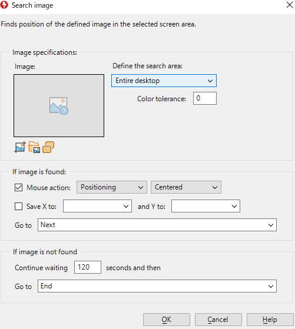](../images/2-7-1_FindImage.png) |  |
| 2-7-1-1 | Search area | 監視対象 | Entire Desktop, Area of Desktop, Focused window, Area of Focused window | 監視対象がArea of Desktop, Area of Focused windowの場合、2-7-1-1-1から2-7-1-1-5までが表示される |  |  |
| 2-7-1-1-1 | Define | 監視対象エリアの定義 | Defineボタンクリック後、ドラッグアンドドロップで監視対象範囲を指定 | ドラッグアンドドロップ後、2-7-1-1-2から2-7-1-1-5までの値が自動入力される |  |  |
| 2-7-1-1-2 | X1 | 監視対象エリアの左上X座標 |  |  |  |  |
| 2-7-1-1-3 | Y1 | 監視対象エリアの左上Y座標 |  |  |  |  |
| 2-7-1-1-4 | X2 | 監視対象エリアの右下X座標 |  |  |  |  |
| 2-7-1-1-5 | Y2 | 監視対象エリアの右下Y座標 |  |  |  |  |
| 2-7-1-2 | Color tolerance | 色許容度 | 0-100% | 0で完全一致 |  |  |
| 2-7-1-3 | Test | 検出テスト | 検出した場合は緑文字でDetectedと表示され、検出した対象へマウスカーソルを移動する。未検出の場合は赤文字でNot Detectedと表示する。検出時間は固定で1秒とする。2-7-1-7から2-7-1-11までの設定は反映しない。 |  |  |  |
| 2-7-1-4 | Capture bitmap | 検出対象の画像切り取り | 検出対象の画像を切り取り | すでに画像がある場合は上書き |  |  |
| 2-7-1-5 | Load bitmap from file | 検出対象の画像読み取り | ファイルから検出対象の画像を開く | すでに画像がある場合は上書き |  |  |
| 2-7-1-7 | Mouse action | 検出成功時のマウス動作のOn, OFF | チェックボックス |  |  |  |
| 2-7-1-7-1 | Mouse action behavior | 検出成功時のマウス動作 | Positioning, Left-Click, Right-Click, Middle-Click, Double-Click |  |  |  |
| 2-7-1-7-2 | Mouse position | 検出成功時のマウス位置 | Center, Top-Left, Top-Right, Bottom-Left, Bottom-Right | Centerの場合、検出矩形の中心 |  |  |
| 2-7-1-8 | Save Coordinate behavior | 検出成功時の座標保存のOn, OFF | チェックボックス |  |  |  |
| 2-7-1-8-1 | Save Coordinate X | 検出成功時のX座標の保存指定 | Variableに保存 |  |  |  |
| 2-7-1-8-2 | Save Coordinate Y | 検出成功時のY座標の保存指定 | Variableに保存 |  |  |  |
| 2-7-1-9 | If true Go to | 検出成功時の動作 | Start, End, Next, Label | Labelはユーザーが定義したラベルの値すべてを表示、Startはマクロ先頭行、Endはマクロ最終行、Nextはマクロの次の行、Labelは一致するLabelの行 |  |  |
| 2-7-1-10 | Waiting ms | 検出までの待機時間(ms) | 単位はms |  |  |  |
| 2-7-1-11 | If false Go to | 検出失敗時の動作 | Start, End, Next, Label | Labelはユーザーが定義したラベルの値すべてを表示、Startはマクロ先頭行、Endはマクロ最終行、Nextはマクロの次の行、Labelは一致するLabelの行 |  |  |
| 2-7-1-12 | OK | OKボタン | 動作の追加 |  |  |  |
| 2-7-1-13 | Cancel | Cancelボタン | Cancel |  |  |  |
| 2-7-2 | Find text (OCR) | テキスト検出動作画面 | OCRはWinOCRを使用 |  |  |  |
| 2-7-2-1 | Text to search for | 検出対象テキスト | 完全一致 |  |  |  |
| 2-7-2-3 | Language | 検出対象言語 | English, Japanese |  |  |  |
| 2-7-2-4 | Search area | 監視対象 | Entire Desktop, Area of Desktop, Focused window, Area of Focused window | 監視対象がArea of Desktop, Area of Focused windowの場合、2-7-2-4-1から2-7-2-4-5までが表示される |  |  |
| 2-7-2-4-1 | Define | 監視対象エリアの定義 | Defineボタンクリック後、ドラッグアンドドロップで監視対象範囲を指定 | ドラッグアンドドロップ後、2-7-2-4-2から2-7-2-4-5までの値が自動入力される |  |  |
| 2-7-2-4-2 | X1 | 監視対象エリアの左上X座標 |  |  |  |  |
| 2-7-2-4-3 | Y1 | 監視対象エリアの左上Y座標 |  |  |  |  |
| 2-7-2-4-4 | X2 | 監視対象エリアの右下X座標 |  |  |  |  |
| 2-7-2-4-5 | Y2 | 監視対象エリアの右下Y座標 |  |  |  |  |
| 2-7-2-5 | Test | 検出テスト | 検出した場合は緑文字でDetectedと表示され、検出した対象へマウスカーソルを移動する。未検出の場合は赤文字でNot Detectedと表示する。検出時間は固定で1秒とする。2-7-2-8から2-7-2-12までの設定は反映しない。 |  |  |  |
| 2-7-2-8 | Mouse action | 検出成功時のマウス動作のOn, OFF | チェックボックス |  |  |  |
| 2-7-2-8-1 | Mouse action behavior | 検出成功時のマウス動作 | Positioning, Left-Click, Right-Click, Middle-Click, Double-Click |  |  |  |
| 2-7-2-8-2 | Mouse position | 検出成功時のマウス位置 | Center, Top-Left, Top-Right, Bottom-Left, Bottom-Right |  |  |  |
| 2-7-2-9 | Save Coordinate behavior | 検出成功時の座標保存のOn, OFF | チェックボックス |  |  |  |
| 2-7-2-9-1 | Save Coordinate X | 検出成功時のX座標の保存指定 | Variableに保存 |  |  |  |
| 2-7-2-9-2 | Save Coordinate Y | 検出成功時のY座標の保存指定 | Variableに保存 |  |  |  |
| 2-7-2-10 | If true Go to | 検出成功時の動作 | Start, End, Next, Label | Labelはユーザーが定義したラベルの値すべてを表示、Startはマクロ先頭行、Endはマクロ最終行、Nextはマクロの次の行、Labelは一致するLabelの行 |  |  |
| 2-7-2-11 | Waiting ms | 検出までの待機時間(ms) | 単位はms |  |  |  |
| 2-7-2-12 | If false Go to | 検出失敗時の動作 | Start, End, Next, Label | Labelはユーザーが定義したラベルの値すべてを表示、Startはマクロ先頭行、Endはマクロ最終行、Nextはマクロの次の行、Labelは一致するLabelの行 |  |  |
| 2-7-2-13 | OK | OKボタン | 動作の追加 |  |  |  |
| 2-7-2-14 | Cancel | Cancelボタン | Cancel |  |  |  |
---

### 3.7 制御（Control Flow）

| 開発ID | 機能名 | 概要 | 起動/操作 | 備考 | UI画像 | 状態 |
|---|---|---|---|---|---|---|
| 2-8 | Misc | その他動作 |  |  |  |  |
| 2-8-1 | Repeat | 繰り返し実行動作画面 | Label〜Repeat行を繰り返す |  |  |  |
| 2-8-1-1 | Start Label | 繰り返し開始Labelを指定 |  |  |  |  |
| 2-8-1-1-1 | Seconds | Repeat条件、秒数 | seconds | Repeat条件は排他運用 |  |  |
| 2-8-1-1-2 | repetitions | Repeat条件、回数 | repetitions | Repeat条件は排他運用 |  |  |
| 2-8-1-1-3 | Until | Repeat条件、終了時間 | HH:mm:ss | Repeat条件は排他運用 |  |  |
| 2-8-1-1-4 | Infinite | Repeat条件、無限 |  | Repeat条件は排他運用 |  |  |
| 2-8-1-2 | Finish Label | Repeat終了後のLabelを指定 | Start, End, Next, Label | Labelはユーザーが定義したラベルの値すべてを表示、Startはマクロ先頭行、Endはマクロ最終行、Nextはマクロの次の行、Labelは一致するLabelの行 |  |  |
| 2-8-2 | Go to | Go to動作画面 | 指定されたLabelの行に移動 |  |  |  |
| 2-8-2-1 | Go to Label | Go to Label指定 | Start, End, Next, Label | Labelはユーザーで定義されたLabelを全列挙 |  |  |
| 2-8-3 | If | If条件動作画面 |  |  |  |  |
| 2-8-3-1 | Variable name | Variable name選択欄 | If条件の対象 | Variableは文字列もしくは数字 |  |  |
| 2-8-3-2 | If | 条件欄 | Text equals, Text begins with, Text ends on, Text include, Text doesn't equal, Text doesn't begin with, Text doesn't end on, Text doesn't include, Text is longer than, Text is shorter than, Value is higher than, Value is lower than, Value is higher-or-equal than, Value is lower-or-equal than, RegEx, Value is defined |  |  |  |
| 2-8-3-3 | Value | 条件の値欄 | 条件の値欄 |  |  |  |
| 2-8-3-4 | If true Go to | 検出成功時の動作 | Start, End, Next, Label | Labelはユーザーが定義したラベルの値すべてを表示、Startはマクロ先頭行、Endはマクロ最終行、Nextはマクロの次の行、Labelは一致するLabelの行 |  |  |
| 2-8-3-5 | If false Go to | 検出失敗時の動作 | Start, End, Next, Label | Labelはユーザーが定義したラベルの値すべてを表示、Startはマクロ先頭行、Endはマクロ最終行、Nextはマクロの次の行、Labelは一致するLabelの行 |  |  |
| 2-8-4 | Embed macro file | マクロファイルの埋め込み画面 |  |  | [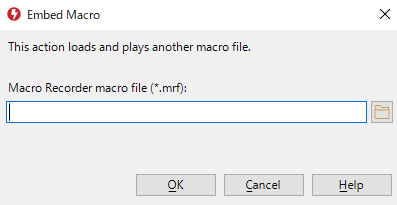](../images/2-8-4_EnableMacroFile.png) |  |
| 2-8-4-1 | Embed macro file path | マクロファイルの指定パス | 指定したマクロファイルを起動する |  |  |  |
| 2-8-5 | Execute program | プログラムの実行画面 |  |  |  |  |
| 2-8-5-1 | Execute program path | プログラムの指定パス | 指定したプログラムを起動する |  |  |  |
---

### 3.8 Playback（再生欄）

| 開発ID | 機能名 | 概要 | 起動/操作 | 備考 | UI画像 | 状態 |
|---|---|---|---|---|---|---|
| 3 | Playback | 再生欄 |  |  |  |  |
| 3-1 | Play | 2-1と同一機能 |  |  |  |  |
| 3-1-1 | Play until selected | 2-1-1と同一機能 |  |  |  |  |
| 3-1-2 | Play from selected | 2-1-2と同一機能 |  |  |  |  |
| 3-1-3 | Play selected | 2-1-3と同一機能 |  |  |  |  |
| 3-2 | Record | 2-2と同一機能 |  |  |  |  |
| 3-2-1 | Insert Record | 2-2-1と同一機能 |  |  |  |  |
| 3-3 | Stop | 2-3と同一機能 |  |  |  |  |
| 3-4 | Playback Properties | 再生設定欄 |  |  |  |  |
| 3-4-1 | Playback Speed | 再生速度（％） |  |  |  |  |
| 3-4-3 | Repeat | マクロファイル繰り返し実行指定 |  |  |  |  |
| 3-4-4 | After playback | 再生後動作 |  |  |  |  |
| 3-5 | Playback filter | 再生マクロ種類 |  |  |  |  |

---

## 4. 共通GoTo仕様

GoTo 指定可能値は以下とする：

- **Start**: マクロ先頭行へ遷移
- **End**: マクロ最終行へ遷移
- **Next**: 次行へ遷移
- **(ユーザー定義Label一覧…)**: 指定ラベル行へ遷移（ユーザー定義ラベル一覧から選択）

補足：
- Labelは一意（重複時は末尾に数字付与。数字付きの場合はインクリメント）

---

以上
